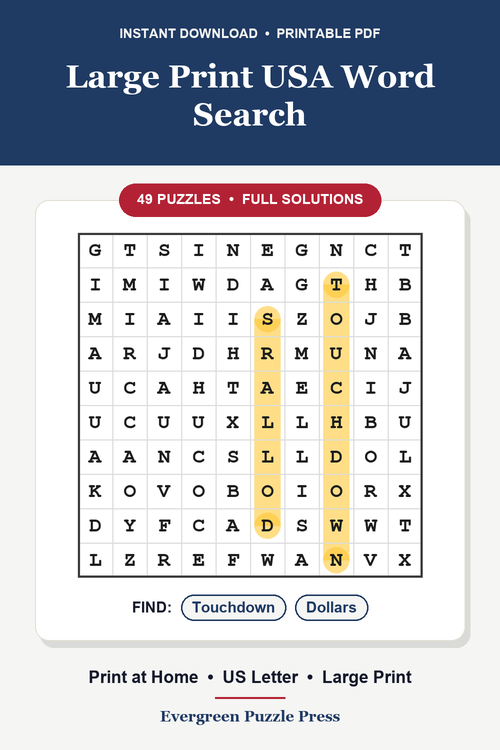
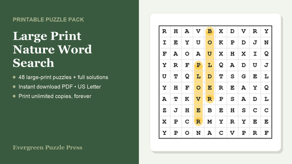

# PinForge

[](https://github.com/vijaxx/pinforge/actions/workflows/ci.yml)

[](LICENSE)

A small pipeline that turns one word-search theme into a sellable digital product line: a print-ready PDF pack, a set of Pinterest pin creatives, SEO copy for each pin, and a manifest tying it all together — then posts the pins and tracks how they perform.

Pinterest is used here as a free, search-driven discovery channel (pins rank in search for months, no audience required, no per-listing fees) that feeds a Gumroad storefront. It's built to run unattended: given a theme name it renders puzzles, builds the PDF, generates pin art, writes SEO copy, and can post directly through an attached Chrome session.

## Sample output

<table><tr>
<td><br><sub>A generated Pinterest pin — real puzzle grid, not a mockup</sub></td>
<td><br><sub>Storefront cover art for the same product</sub></td>
</tr></table>

## How it fits together

```
factory.py --theme <name>
   ├─ pack.py         puzzle grids + solutions → print-ready PDF (reportlab)
   ├─ pins.py         1000x1500 Pinterest creatives, real mini puzzle grid rendered in (Pillow)
   ├─ pincopy.py       SEO titles/descriptions (local Ollama, falls back to templates if it's down)
   └─ manifest.json    everything above, stitched together
```

- **`cdp.py`** — thin Chrome DevTools Protocol client. Everything that touches a live browser session goes through here.
- **`post_pin.py`** — posts a single pin through Pinterest's pin-builder UI over CDP. React-controlled inputs don't accept a plain `.value` assignment, so text fields are set through React's native value setter; images go through `DOM.setFileInputFiles`.
- **`list_gumroad.py`** — drives Gumroad's product creation flow the same way.
- **`run_batch.py`** — the daily driver: posts a batch of pins, respecting per-day limits and cool-downs so the account doesn't look automated to Pinterest's spam detection.
- **`sampler.py`** / **`build_bundle.py`** — two funnel products: a free 10-puzzle lead magnet, and a bundle of every pack merged into one PDF for a bigger single sale.
- **`analytics_db.py`** — SQLite store that turns the append-only posting log and Gumroad sales exports into something queryable (impressions/saves/clicks per pin, sales by referrer).
- **`gen_cover.py`**, **`gen_promo.py`**, **`gen_store_assets.py`** — cover art, promotional pin variants, and storefront banner/thumbnail generation.

Puzzle generation itself (grid layout, word placement, solution rendering) lives in a sibling project — this repo imports it as `wordsearch` via a relative path (`../kdp`). Clone [kdp-puzzle-engine](https://github.com/vijaxx/kdp-puzzle-engine) next to this one if you want to run the pack/pin generation locally.

## Stack

Python, Pillow (pin rendering), reportlab + pypdf (PDF generation/merging), SQLite (analytics), Chrome DevTools Protocol over a websocket (posting automation), Ollama running `qwen2.5:3b` locally for SEO copy generation.

## Running it

```
pip install -r requirements.txt
python3 factory.py --theme animals      # build one product line
python3 factory.py --all                # build every configured theme
./ensure_chrome_pinforge.sh             # bring up the dedicated Chrome profile
python3 run_batch.py                    # post today's batch of pins
```

Needs a Gumroad account and a Pinterest Business account logged into the Chrome profile `ensure_chrome_pinforge.sh` manages; posting credentials are never stored in this repo.
